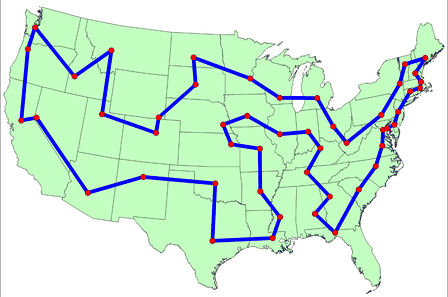

# Traveller-Salesperson-Problem 

## Description
[Traveller Salesperson Problem](https://en.wikipedia.org/wiki/Self-avoiding_walk) is a challenge is AI and most famous problem in operation research for finding shortest path. The base of this code belongs to [Daniel Shiffman](https://github.com/shiffman/The-Nature-of-Code). We will use this code as educational resource (in video series) for optimizing (minimizing time and process) the solution. 

### Implemented with p5js web version of Processing

